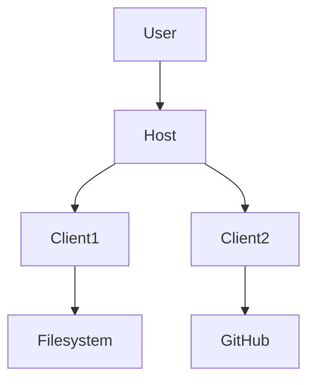
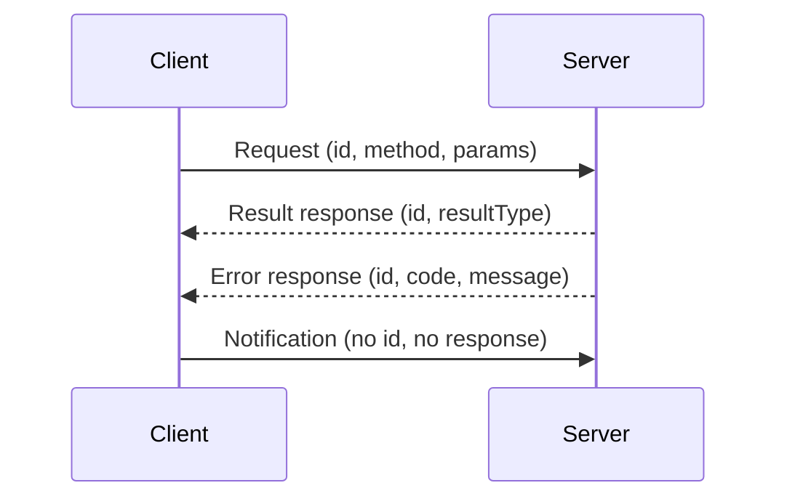
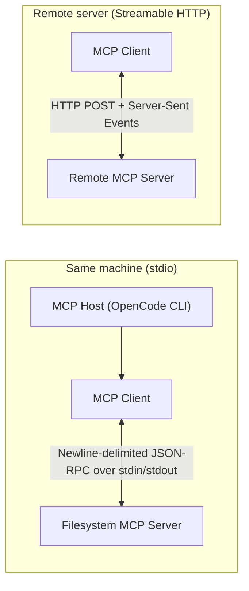
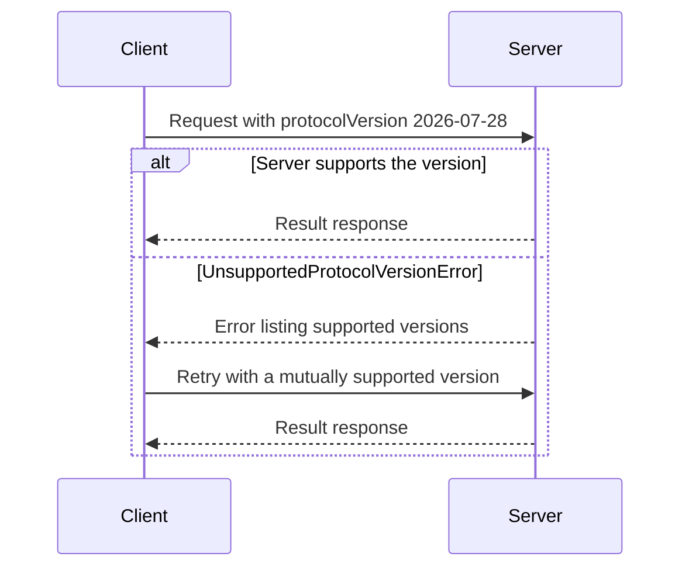
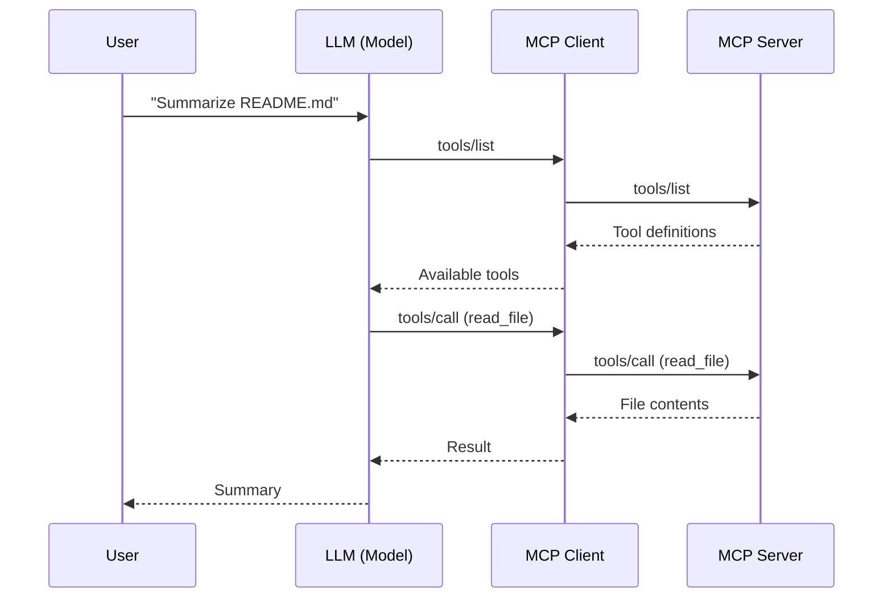
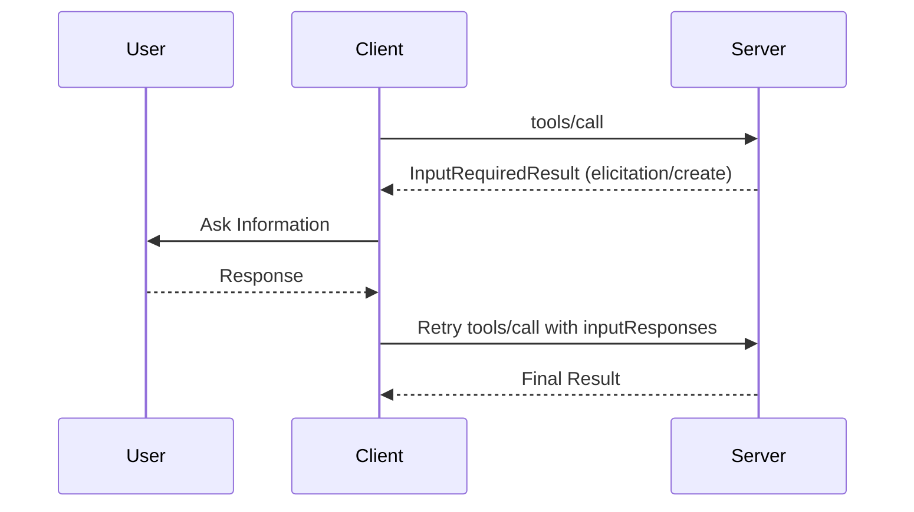
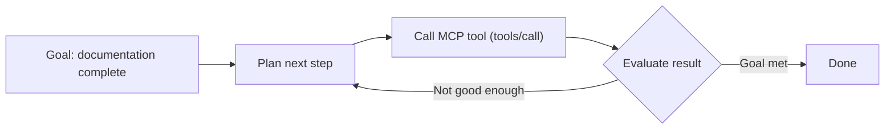

# Agent Concepts and MCP Basics

## Introduction

Artificial Intelligence systems are becoming more capable every day, but not every AI application is an agent. Many modern AI systems are actually workflows that follow predefined steps. In this assignment, I studied Anthropic's "Building Effective Agents" article and learned the difference between workflows and agents. I also explored the Model Context Protocol (MCP), connected an MCP server using OpenCode CLI, and completed several tasks that required real tool usage.

---

# What is a Workflow?

According to Anthropic, a workflow is an AI system where the developer defines the sequence of steps in advance. The LLM performs tasks according to a fixed process controlled by code.

In a workflow, every stage is already planned. The model does not decide what to do next because the developer has already written the execution path.

Examples of workflow patterns include:

- Prompt Chaining
- Routing
- Parallelization
- Orchestrator-Workers
- Evaluator-Optimizer

These workflows improve accuracy and organization while remaining predictable and easy to control.

---

# What is an Agent?

An agent is a more autonomous AI system.

Instead of following a predefined sequence, the LLM decides which actions should be taken, which tools should be used, and what the next step should be based on the current situation.

Agents can:

- Plan tasks
- Use external tools
- Analyze tool results
- Recover from errors
- Continue working until the goal is completed
- Ask the user for clarification when necessary

Unlike workflows, agents make decisions dynamically instead of following a fixed path.

---

# Workflow vs Agent

The biggest difference between workflows and agents is control.

In a workflow, the developer controls every step. The LLM simply follows the predefined sequence.

In an agent, the LLM controls the process itself. It decides which tool to call, what information it needs, and how many steps are required to finish the task.

| Workflow                  | Agent                     |
| ------------------------- | ------------------------- |
| Fixed execution path      | Dynamic execution         |
| Developer controls logic  | LLM controls planning     |
| Predictable               | Flexible                  |
| Best for structured tasks | Best for open-ended tasks |
| Limited autonomy          | High autonomy             |

Anthropic recommends starting with simple workflows and only using agents when flexibility is truly required.

---

# Why My FL-04 Pipeline is a Workflow

My FL-04 project is a workflow rather than an agent.

The pipeline follows predefined steps where prompts are executed in a fixed order. Every stage has a specific purpose, such as generating documentation, reviewing outputs, and producing summaries.

The LLM does not decide what to do next. Instead, I manually define each prompt and execute the workflow step by step.

Because the execution path is predetermined and controlled by me, the project matches Anthropic's definition of a workflow instead of an autonomous agent.

---

# What is MCP?

## Definition

The **Model Context Protocol (MCP)** is an open-source standard for connecting AI applications to external systems. Using MCP, AI applications like Claude or ChatGPT can connect to:

- **Data sources** — local files, databases, knowledge bases
- **Tools** — search engines, calculators, APIs, command runners
- **Workflows** — reusable, specialized prompts

Instead of keeping an AI model limited to a chat window, MCP enables it to interact with real-world resources such as files, APIs, databases, GitHub repositories, and other services through one consistent interface.

## Why MCP Exists

Before MCP, every AI application that needed external data had to build a custom integration for each tool. A single assistant might need separate, hand-written connectors for a database, a file system, a calendar, and a messaging app — each with its own authentication, message format, and lifecycle management. This approach is:

- **Slow** — every new integration requires significant development effort.
- **Brittle** — custom code breaks whenever an API changes.
- **Not reusable** — an integration written for one application cannot be used by another.

MCP was created to solve this problem by standardizing the connection between AI applications and the systems they interact with, so that a tool exposed once can be consumed by any MCP-compatible application.

## The USB-C Analogy

Think of MCP like a **USB-C port for AI applications**. Just as USB-C provides a standardized way to connect electronic devices, MCP provides a standardized way to connect AI applications to external systems — one port, many devices.

| USB-C | MCP |
| ----- | --- |
| Standard connector for devices | Standard protocol for AI applications |
| One port, many peripherals | One interface, many servers |
| Plug-and-play hardware | Add-and-go tool integration |
| Universal across manufacturers | Interoperable across AI clients |

## Benefits

MCP delivers benefits across the whole ecosystem:

- **For developers** — MCP reduces development time and complexity when building, or integrating with, an AI application or agent. A server is written once and works with every MCP-compatible client.
- **For AI applications and agents** — MCP provides access to an ecosystem of data sources, tools, and apps which enhances capabilities and improves the end-user experience.
- **For end-users** — MCP results in more capable AI applications or agents which can access your data and take actions on your behalf when necessary.

## Real-World Use Cases

- **Personal assistants** — Agents can access Google Calendar and Notion, acting as a more personalized AI assistant.
- **Design-to-code** — Claude Code can generate an entire web application from a Figma design.
- **Enterprise analytics** — Chatbots can connect to multiple databases across an organization, letting users analyze data through natural conversation.
- **Creative and physical tools** — AI models can create 3D designs in Blender and send them to a 3D printer.

---

# Why MCP Matters

AI applications are only as useful as the information and actions they can access. A model trained on static data cannot read your files, query your database, or send a message on your behalf — it needs a standardized mechanism to reach the outside world.

Without a shared standard, every team building an "AI with tools" must reinvent the same plumbing: connection management, authentication, message formatting, and error handling. MCP removes that duplication.

| Custom Integration | MCP |
| ------------------ | --- |
| One connector per tool per app | One server, many compatible clients |
| Application-specific protocols | Standardized JSON-RPC messages |
| Hand-written auth per service | Shared authorization framework |
| Hard to share across teams | Published, reusable servers |

**Examples of why a standard protocol matters:**

- A Filesystem MCP server is written once by the community and can then be used by Claude, ChatGPT, VS Code, Cursor, and any other MCP host without modification.
- An organization can expose its internal APIs as MCP servers once, and every AI application inside the company can immediately use them.
- New tools adopt MCP at the server level, and every connected application gains access automatically — no per-client development required.

MCP also makes integration safer. Because interactions flow through a well-defined protocol with explicit capabilities and approval controls, users and administrators can audit what an AI application can see and do.

---

# MCP Ecosystem

MCP is an open protocol with broad ecosystem support across clients and servers — making it easy to build once and integrate everywhere.

## Clients and Hosts

| Client / Host | Type | MCP Support |
| ------------- | ---- | ----------- |
| Claude | AI assistant | Native MCP support for connected tools |
| Claude Code | AI coding agent | Native MCP support |
| ChatGPT | AI assistant | MCP support via the OpenAI developer platform |
| Visual Studio Code | IDE | MCP servers via GitHub Copilot Chat |
| Cursor | AI code editor | MCP support for context and tools |

## MCP Servers

MCP servers are programs that expose specific capabilities to AI applications through standardized protocol interfaces. Common examples include:

- **Filesystem servers** — read and write local project files.
- **Database servers** — query data and inspect schemas.
- **GitHub servers** — manage repositories, issues, and pull requests.
- **Calendar and email servers** — manage schedules and communications.
- **Search servers** — run web and knowledge-base searches.

## IDE Integrations

IDEs are important MCP hosts because coding assistants benefit directly from filesystem, source control, and build tool access. By connecting MCP servers to an IDE, developers can:

- Let the assistant read and modify files within the workspace.
- Give it access to issue trackers, documentation, and internal APIs.
- Keep permission controls local to the development environment.

In this assignment, OpenCode CLI acted as the MCP host and ran the Filesystem MCP server so I could complete real file operations from inside the AI session.

---

# MCP Architecture

MCP follows a client-server architecture with three key participants:

## Participants

| Participant | Description |
| ----------- | ----------- |
| **MCP Host** | The AI application the user interacts with. It coordinates and manages one or more MCP clients and decides how to use the context they provide. |
| **MCP Client** | A component inside the host that maintains a dedicated connection to exactly one MCP server. |
| **MCP Server** | A program that provides context (tools, resources, prompts) to MCP clients. |

A host creates one client per server. For example, Visual Studio Code (the host) instantiates an MCP client object to connect to a filesystem server and another MCP client object to connect to a GitHub server. Local servers using the stdio transport typically serve a single client, while remote servers using Streamable HTTP typically serve many clients.



## Responsibilities

- **MCP Host** — manages the user experience: launching servers, aggregating capabilities across clients, deciding which tools, resources, and prompts the model can use, and enforcing approval and permission rules.
- **MCP Client** — handles protocol communication with one server: discovery, tool calls, resource reads, and notification subscriptions.
- **MCP Server** — provides the actual capability: implements `server/discover`, exposes tools, resources, and prompts, and executes them.

This separation of concerns means a server developer never builds UI, and an application developer never re-implements connectors.

---

# MCP Layers

MCP consists of two layers — an inner **data layer** and an outer **transport layer**.

## Data Layer

The data layer defines the JSON-RPC 2.0 based exchange protocol, including message structure and semantics. It covers:

- **JSON-RPC** — all messages follow JSON-RPC 2.0: requests (with an `id`), result responses (with a `resultType` of `"complete"` or `"input_required"`), error responses (with a numeric `code` and `message`), and notifications (no `id`, no response expected).
- **Discovery** — clients can query a server's supported protocol versions, capabilities, and identity through the mandatory `server/discover` request.
- **Primitives** — tools, resources, and prompts (described below).
- **Notifications** — real-time, opt-in updates such as `notifications/tools/list_changed`.
- **Capabilities** — every request declares the protocol version and client capabilities in its `_meta` field, keeping the protocol stateless.
- **Elicitation** — lets servers request additional information from the user.

The data layer defines the shape of every exchange between a client and a server. A request carries an `id` and always receives a response, a result response reports success, an error response carries a numeric `code` and a `message`, and a notification has no `id` and expects no response:



## Transport Layer

The transport layer manages the communication channels, message framing, and authentication between clients and servers. It abstracts transport details away from the protocol, so the same JSON-RPC messages work everywhere.

| Transport | Description | Use Case |
| --------- | ----------- | -------- |
| **stdio** | Newline-delimited JSON-RPC messages over the standard input/output streams of a client-launched subprocess. | Local servers on the same machine, e.g. the Filesystem MCP server. |
| **Streamable HTTP** | Each message is an HTTP POST to a single MCP endpoint; replies arrive as a JSON object or a request-scoped Server-Sent Events (SSE) stream. | Remote servers; supports OAuth, bearer tokens, API keys, and custom headers. |

In this assignment, the Filesystem MCP server ran locally over the stdio transport, launched by OpenCode CLI as a subprocess.



The choice of transport is transparent to the protocol — the same JSON-RPC messages work over both.

---

# Versioning

## Version Format

MCP uses string-based version identifiers in the format `YYYY-MM-DD`, indicating the last date backwards-incompatible changes were made. The version is **not** incremented for backwards-compatible additions, which allows incremental improvements while preserving interoperability.

## Revisions

| State | Meaning |
| ----- | ------- |
| **Draft** | In-progress specification, not yet ready for consumption. |
| **Current** | The current protocol version, ready for use; may continue to receive backwards-compatible changes. |
| **Final** | A past, complete specification that will not be changed. |

The **current** protocol version is **2026-07-28**.

## Feature Lifecycle

Individual features follow a lifecycle of **Active → Deprecated → Removed**:

- **Active** — the feature is part of the current specification.
- **Deprecated** — the feature remains in the specification but is scheduled for removal and documents a migration path. It stays for at least twelve months (or at least ninety days under the expedited-removal exception) before becoming eligible for removal.
- **Removed** — the feature is removed in a future revision.

As of protocol version `2026-07-28`, the **Roots**, **Sampling**, and **Logging** features are Deprecated (along with Dynamic Client Registration and the older HTTP+SSE transport).

## Version Negotiation

Because the protocol is stateless, **every request** declares the protocol version it is speaking in the `io.modelcontextprotocol/protocolVersion` key of its `_meta` field. Clients and servers may support multiple protocol versions simultaneously.

If a server does not support the requested version, it responds with an **`UnsupportedProtocolVersionError`** listing the versions it does support. The client then retries the request with a mutually supported version, or surfaces an error to the user if none exists.

Clients that want to select a version up front can call **`server/discover`**, a mandatory RPC that returns the server's supported protocol versions, capabilities, and identity in a single request. Calling it is optional — a client may send any request directly and handle a version error if one comes back — and the response is typically cacheable, so discovery does not need to be repeated for every request.

The negotiation flow looks like this:



---

# MCP Primitives

MCP primitives define what clients and servers can offer each other. Servers expose three core primitives, each with discovery (`*/list`) and retrieval (`*/get`) methods:

| Primitive | Control | Purpose | Methods |
| --------- | ------- | ------- | ------- |
| **Tools** | Model | Executable functions the model can call to perform actions | `tools/list`, `tools/call` |
| **Resources** | Application | Read-only data sources that provide context | `resources/list`, `resources/read`, `resources/templates/list` |
| **Prompts** | User | Reusable templates that structure interactions | `prompts/list`, `prompts/get` |

## Tools

Tools are **executable functions** that an LLM can actively call — and the model decides when to use them based on the user's request. Tools can write to databases, call external APIs, modify files, or trigger other logic.

- **`tools/list`** — the client discovers available tools and receives an array of tool definitions.
- **`tools/call`** — the client executes a specific tool with arguments.

Each tool defines a name, a description, and an `inputSchema` written in JSON Schema, enabling type validation and self-documentation:

```json
{
  "name": "read_file",
  "description": "Read a file from the workspace",
  "inputSchema": {
    "type": "object",
    "properties": {
      "path": { "type": "string", "description": "Absolute path of the file" }
    },
    "required": ["path"]
  }
}
```

### Model Controlled

Tools are **model-controlled**: the LLM discovers them and invokes them automatically based on the conversation. Human oversight is preserved through mechanisms such as approval dialogs for individual tool executions, permission settings for pre-approved safe operations, and activity logs showing every tool execution and its result.

The full discovery-and-execution flow for a tool call looks like this:



## Resources

Resources provide **structured, read-only access to information** that the AI application retrieves and passes to the model as context — file contents, database schemas, API documentation, and similar data.

- **`resources/list`** — lists available direct resources.
- **`resources/read`** — retrieves the contents of a specific resource.
- **`resources/templates/list`** — discovers resource templates.

Each resource has a unique URI (e.g., `file:///path/to/document.md`) and declares its MIME type for appropriate content handling. Two discovery patterns exist:

- **Direct resources** — fixed URIs that point to specific data, e.g. `calendar://events/2024`.
- **Resource templates** — dynamic URIs with parameters for flexible queries, e.g. `travel://activities/{city}/{category}`.

### Application Controlled

Resources are **application-controlled**: the application decides which resources to retrieve, how to process them (selection, embedding search, or full pass-through), and how to present them to the model. This gives the application full flexibility over how context is gathered and used.

## Prompts

Prompts are **reusable templates** that MCP server authors provide to structure interactions with the model, or to showcase the best way to use a server. They are parameterized: a prompt defines named arguments that the user fills in.

- **`prompts/list`** — discovers available prompts.
- **`prompts/get`** — retrieves a full prompt definition with its arguments.

### User Controlled

Prompts are **user-controlled**, requiring explicit invocation rather than automatic triggering. Applications typically expose them through slash commands (typing `/` shows available prompts), command palettes, dedicated buttons, or context menus.

---

# MCP Client Features

While servers expose tools, resources, and prompts, clients can offer features back to servers that enable richer interactions.

## Elicitation

Elicitation lets a **server request specific information from the user** during an interaction. Instead of requiring all information up front or failing when data is missing, a server can pause, ask for exactly what it needs, and then continue. Elicitation supports two modes:

### Form Mode

In **form mode**, the server asks the client to collect structured data from the user. The request includes a `requestedSchema` (a restricted JSON Schema) that the client uses to build an input form and validate the response. Form mode is suitable for general information such as names, preferences, or confirmations.

### URL Mode

In **URL mode**, the server provides a URL for the user to open. The interaction happens **out of band** and its data never passes through the client or the LLM context, making it suitable for sensitive flows such as credential entry, payment processing, or third-party OAuth authorization.

### The Complete Elicitation Flow

Elicitation follows the **Multi Round-Trip Requests (MRTR)** pattern:

1. The client sends a request, such as `tools/call`.
2. If the server needs more information, it responds with an `InputRequiredResult` whose `inputRequests` field carries an `elicitation/create` request.
3. The client presents an elicitation UI to the user.
4. The user provides the requested information.
5. The client retries the original request, attaching the collected `inputResponses`.
6. The server continues processing with the new information and returns the final result.



### Security and Privacy

- Servers **MUST NOT** use form mode to request sensitive information such as passwords, API keys, access tokens, or payment credentials — those interactions belong in URL mode so the data never passes through the client.
- Clients **MUST** clearly indicate which server is requesting information, allow users to review and modify form data before sending, and provide decline and cancel options at any time.
- For URL mode, clients **MUST** show the full URL, gather explicit consent before opening it, and never fetch it automatically.
- Users respond with one of three actions: **accept** (submit data), **decline** (explicitly reject), or **cancel** (dismiss without a choice).

## Roots (Deprecated)

Roots let clients communicate filesystem boundaries to servers so servers understand where they may operate. As of protocol version `2026-07-28`, Roots are **Deprecated** and scheduled for removal. New implementations should pass directories or files via tool parameters, resource URIs, or server configuration instead.

## Sampling (Deprecated)

Sampling allowed servers to request LLM completions through the client, keeping the client in control of user permissions and security measures. As of protocol version `2026-07-28`, Sampling is **Deprecated** and scheduled for removal. New implementations should integrate directly with LLM provider APIs.

---

# Notifications

MCP supports real-time, **opt-in notifications** so servers can inform clients of changes without being polled.

To receive them, a client opens a long-lived notification stream with `subscriptions/listen`, naming the notification types it wants (for example, `toolsListChanged`). The server acknowledges the subscription and then delivers matching notifications on that stream.

When a server's available tools change — new tools added, existing tools modified, or tools temporarily unavailable — the server sends a **`notifications/tools/list_changed`** notification:

```json
{
  "jsonrpc": "2.0",
  "method": "notifications/tools/list_changed"
}
```

Key characteristics:

- **Opt-in** — only clients that requested the notification in their subscription filter receive it, and only from servers that advertise `tools.listChanged` in their capabilities.
- **No response** — like all JSON-RPC notifications, none is expected or sent.
- **Best effort** — notifications are not guaranteed across transport reconnects, so clients should still rely on polling to preserve freshness.

When a client receives `notifications/tools/list_changed`, it **refreshes its tool list by re-issuing `tools/list`** and updates the model's available capabilities. This keeps ongoing conversations in sync with the server's current functionality.

---

# Security Considerations

Connecting AI applications to real systems is powerful, but it also introduces real security considerations. Because tools can read files, modify data, call APIs, and trigger actions, a safe deployment depends on granting the minimum access needed and auditing everything that happens.

## Least Privilege

MCP servers should be granted the **minimum access required** to do their job. In this assignment, the Filesystem MCP server was configured with only the project workspace as its allowed root, so it could never read or modify files outside:

```text
G:\Data_Science\flyrank-frontend-ai-engineering\assignments\week-04\task-06-agent-concepts-and-mcp-basics
```

## Human Oversight

Because tools are model-controlled, human oversight is built into the flow:

- **Approval dialogs** — the host asks the user before executing sensitive tool calls.
- **Permission settings** — pre-approved safe operations run without prompting; everything else is gated.
- **Activity logs** — every tool execution and its result is recorded for review and auditing.

## Transport Security

| Transport | Security Model |
| --------- | -------------- |
| **stdio** | Local only — the server is a subprocess on the same machine, so there is no network exposure. |
| **Streamable HTTP** | Remote — supports OAuth, bearer tokens, API keys, and custom headers; should only be served over HTTPS. |

## Elicitation Privacy

Sensitive data such as passwords, API keys, and payment credentials **must** only be collected through URL mode, where the interaction happens out of band and never passes through the client or the LLM context.

## Data Exfiltration Risk

Resources are read-only by design, but tools can change data. A compromised or over-permissioned server could expose or modify sensitive information. Servers should therefore:

- Restrict allowed directories and file patterns.
- Reject operations outside their configured scope.
- Expose only the minimum set of tools needed for the task.

---

# Filesystem MCP Server

The **Filesystem MCP Server** is an official MCP server that exposes local file and directory operations to MCP clients through standardized tools. It is the server I used throughout this assignment.

## What It Does

It lets an AI application perform real filesystem operations that a normal chat session cannot:

- List directories and build recursive directory trees.
- Read files and retrieve file metadata.
- Search for files by name pattern.
- Move or copy files when permitted.

## How It Runs

The server is launched as a **local subprocess over the stdio transport**, using the npm package:

```bash
npx -y @modelcontextprotocol/server-filesystem
```

Because it runs locally, it never exposes data over the network. Access is scoped to the directories configured for the server — in this assignment, only the project workspace root.

## Tools I Actually Used

During the assignment, the following Filesystem MCP tools were exercised through `tools/list` discovery and `tools/call` execution:

| Tool | Purpose |
| ---- | ------- |
| `search_files` | Recursively find all `*.md` files |
| `read_text_file` | Open README.md and EXPLAINER.md |
| `list_directory` | List top-level folders and files |
| `directory_tree` | Generate the workspace tree |
| `get_file_info` | Retrieve file sizes and metadata |

These calls demonstrated the complete MCP discovery-and-execution flow against a real, local data source.

---

# OpenCode CLI as MCP Host

In this assignment, **OpenCode CLI** acted as the **MCP host** — the AI application I interacted with. As a host, it is responsible for:

- **Launching servers** — starting the Filesystem MCP server as a local subprocess.
- **Managing clients** — creating one MCP client per connected server.
- **Aggregating tools** — discovering tools through `tools/list` and exposing them to the model.
- **Enforcing permissions** — gating tool calls behind approval and permission rules.
- **Logging activity** — recording every tool execution for transparency.

The connection was configured and verified with:

```bash
npx -y @modelcontextprotocol/server-filesystem
opencode mcp list --print-logs --log-level DEBUG
```

With OpenCode CLI as the host, I could ask for real file operations and have the model plan, select, and execute the right MCP tools — the same pattern an autonomous agent would use.

---

# My MCP Demonstration

During this assignment, I configured the **Filesystem MCP Server** and connected it to my local project through **OpenCode CLI**, which acted as the MCP host. The server ran locally over the stdio transport and successfully established a connection.

Once connected, I completed several tasks that a normal chat session could not perform, because each one required direct access to the local filesystem:

1. **Reading Markdown files** — listed all Markdown (`.md`) files in the project directory using the filesystem tools.
2. **Summarizing README.md** — opened the README file and generated a summary of its contents.
3. **Counting Markdown files** — counted the Markdown files in the workspace and analyzed their contents.

These tasks exercised the `tools/list` discovery flow and `tools/call` execution against the filesystem server. The successful completion of all three tasks confirmed that the MCP server was working correctly and demonstrated how the protocol enables AI applications to interact with real, local data.

---

# How My FL-04 Workflow Could Become an Agent

To transform my FL-04 workflow into an autonomous agent, the system would need to make its own decisions instead of following predefined prompts.

For example, the agent could:

- Decide which project files need analysis.
- Select the appropriate MCP tools automatically.
- Generate missing documentation without manual prompting.
- Review generated outputs.
- Detect errors and retry failed steps.
- Continue improving documentation until quality requirements are met.

MCP would be the backbone of this upgrade. Instead of hard-coding integrations, the agent would connect to Filesystem, GitHub, and documentation servers through MCP and automatically discover the tools available to it. It could then plan its own sequence of `tools/call` executions — reading project files, checking the README, generating missing sections, and reviewing its own output — until the goal is met. This is exactly how agents differ from workflows: the model, not the developer, decides the next step, and MCP gives it a standardized interface to act on real data.



Instead of requiring me to execute every prompt manually, the agent would plan, act, evaluate results, and continue working independently.

This would match Anthropic's definition of an autonomous AI agent.

---

# Conclusion

This assignment helped me understand the important difference between workflows and agents. My FL-04 project is a workflow because it follows predefined execution steps controlled by the developer. Agents, however, make their own decisions, dynamically select tools, and adapt to changing situations.

I also learned how Model Context Protocol enables AI systems to interact with external resources through standardized tools. By configuring the Filesystem MCP Server in OpenCode CLI and successfully completing multiple tool-based tasks, I gained practical experience with MCP and understood how workflows can gradually evolve into intelligent AI agents.
