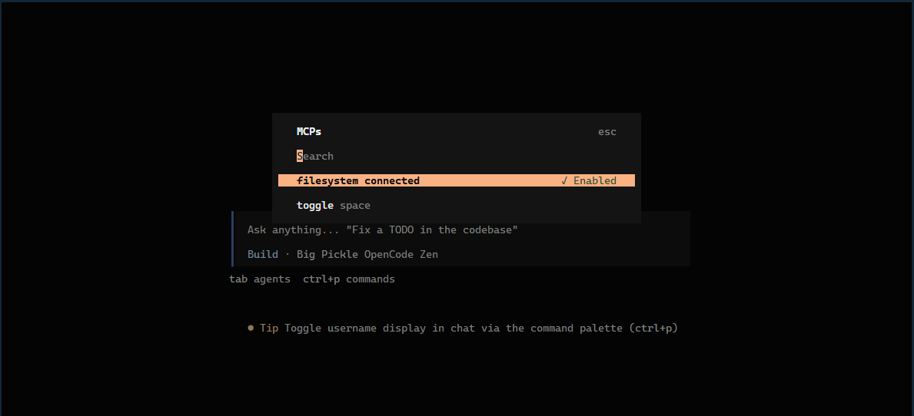

# MCP Setup

This document records how I configured the **Filesystem MCP Server** and connected it to this project through **OpenCode CLI**. It is part of Task 06 – Agent Concepts and MCP Basics (see [README.md](README.md)).

## Environment

- OpenCode CLI (MCP host)
- Filesystem MCP Server
- Node.js
- npm
- Visual Studio Code

## MCP Server

The **Filesystem MCP Server** exposes local file and directory operations to AI applications through standardized MCP tools. It runs locally over the **stdio transport** as a subprocess launched by the host.

Package:

```bash
@modelcontextprotocol/server-filesystem
```

## Configuration Steps

1. Installed OpenCode CLI.
2. Added a local Filesystem MCP server to OpenCode.
3. Configured the server with the project workspace as its allowed root:

```bash
npx -y @modelcontextprotocol/server-filesystem
```

4. Verified the server connection using:

```bash
opencode mcp list --print-logs --log-level DEBUG
```

5. Confirmed the connection inside OpenCode and completed the assignment tasks using the Filesystem MCP tools.

## Result

The MCP server connected successfully over stdio and was able to read local project files from the workspace root:

```text
G:\Data_Science\flyrank-frontend-ai-engineering\assignments\week-04\task-06-agent-concepts-and-mcp-basics
```

The verified connection is captured in the screenshot below:



For the tasks completed using the server, see [MCP_TASKS.md](MCP_TASKS.md). For the concepts behind MCP, see [EXPLAINER.md](EXPLAINER.md).
